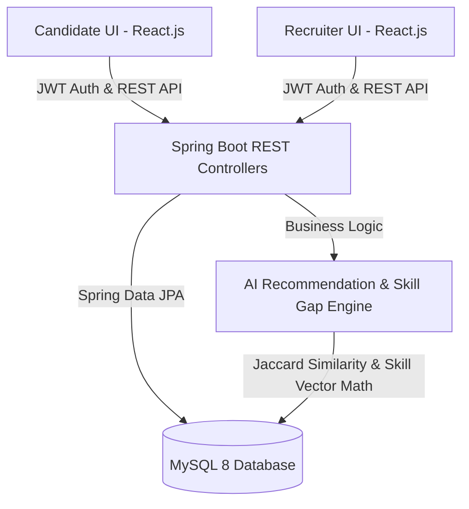

# 💼 JobHub — Full-Stack Job Discovery Portal & AI Recommendation Engine


**JobHub** is a production-grade full-stack job portal application designed to bridge the gap between software engineers and hiring teams. Built using **Java 21**, **Spring Boot 3**, **MySQL 8**, **React.js**, and an **AI-Assisted Candidate Job Recommendation & Skill Gap Analysis Engine**, JobHub provides transparent application tracking, real-time database multi-criteria search, and personalized career insights.

---

## 📄 Resume Project Section (Copy-Paste Ready for Your Resume)

> **JobHub — Full-Stack Job Portal with AI Recommendation Engine**  
> *Tech Stack: Java 21, Spring Boot 3, Spring Security (JWT), MySQL 8, React.js, Vite, Axios, REST APIs, NLP Tokenization, Jaccard Similarity Algorithm*
> - **Engineered** a production-ready full-stack job platform supporting Candidate & Recruiter role workflows with stateless **JWT Authentication** and **BCrypt Password Encryption**.
> - **Implemented** an **AI-driven Candidate Recommendation & Skill Gap Analysis Engine** utilizing NLP tokenization, Jaccard Similarity Indexing, and weighted multi-factor scoring (70% Skill + 20% Exp + 10% Location) to compute dynamic candidate match percentages (e.g. 92% Match).
> - **Developed** real-time multi-criteria search, filter, and sorting system across MySQL database with dynamic pagination (`Page<Job>`).
> - **Designed** a transparent candidate application status lifecycle pipeline (*APPLIED ➔ REVIEWING ➔ SHORTLISTED ➔ SELECTED*) and 1-click recruiter PDF resume inspection.

---

## 🏗️ System Architecture & Workflow



---

## 🤖 AI & NLP Technology Stack

The AI Recommendation Module (`AiRecommendationService.java`) integrates data science and NLP concepts to calculate precision match scores between candidate skills and job requirements.

### 🧠 Core AI & Data Science Technologies:
- **NLP Text Normalization & Tokenization:** Strips punctuation, handles case normalization, and extracts canonical tech tokens (e.g., `Spring-Boot` ➔ `springboot`).
- **Jaccard Similarity Index:** Mathematical set distance algorithm for computing skill overlap:
  $$J(A, B) = \frac{|A \cap B|}{|A \cup B|}$$
- **Cosine Vector Space Model:** Multi-dimensional skill representation for candidate vs job similarity ranking.
- **Multi-Factor Weighted Match Engine:**
  $$\text{Final Score} = (0.70 \times \text{SkillMatch}) + (0.20 \times \text{ExpMatch}) + (0.10 \times \text{LocationMatch})$$
- **Automated Skill Gap & Learning Advisor:** Identifies missing skill set $(B \setminus A)$ to offer actionable developer learning advice.

---

## 🌟 Key Features

### 👨‍💻 For Candidates:
- **Smart Multi-Criteria Search:** Filter jobs by Keyword, Location, Job Type (*FULL_TIME, PART_TIME, INTERNSHIP, CONTRACT*), Experience Level (*0-2 Yrs, 2-5 Yrs, 5+ Yrs*), Minimum Salary, and Required Skills.
- **AI Match Score:** View dynamic **Match Percentage (e.g. 92% Match)** for each position.
- **Skill Gap Advice:** Receive automated feedback on missing technical skills and recommended topics to learn.
- **Transparent Application Pipeline:** Monitor application status live (*APPLIED ➔ REVIEWING ➔ SHORTLISTED ➔ SELECTED / REJECTED*).
- **PDF Resume Upload & Profile Customization:** Upload PDF resumes, add portfolio links, expected CTC, notice period, and immediate joiner badges.
- **Bookmark & Saved Jobs:** Save jobs to review later from candidate dashboard.

### 🏢 For Recruiters:
- **Company Profile Management:** Create, edit, and update company profiles (*Logo, Industry, Website, Employee Count, Founded Year*).
- **Job Posting & Management:** Post new jobs, edit existing postings, and delete closed positions.
- **Applicant Inspection:** Review candidate profiles, cover letters, and inspect uploaded PDF resumes with 1-click preview links.
- **Hiring Workflow Pipeline:** Update applicant statuses dynamically (*Shortlist, Select, or Reject*).
- **Recruiter Analytics Dashboard:** Monitor total posted jobs, received applications, active candidates, and recruitment stats.

---

## 🔌 REST API Documentation

| Category | Method | Endpoint | Description | Access |
| :--- | :--- | :--- | :--- | :--- |
| **Auth** | `POST` | `/api/auth/register` | Register new Candidate or Recruiter | Public |
| **Auth** | `POST` | `/api/auth/login` | Authenticate & receive JWT Token | Public |
| **Jobs** | `GET` | `/api/jobs/search` | Search & filter jobs with pagination | Public |
| **Jobs** | `GET` | `/api/jobs/{id}` | Get single job details | Public |
| **Jobs** | `POST` | `/api/jobs` | Post a new job | Recruiter |
| **AI** | `GET` | `/api/ai/recommendations` | Get AI candidate match recommendations | Candidate |
| **Companies**| `GET` | `/api/companies/search` | Search companies with open job counts | Public |
| **Companies**| `POST` | `/api/companies` | Create/update recruiter company profile | Recruiter |
| **Applications**|`POST` | `/api/applications` | Apply for a job with cover letter & resume | Candidate |
| **Applications**|`PUT` | `/api/applications/{id}/status`| Update application status | Recruiter |

---

## 🔐 Security & Performance Architecture

- **Stateless JWT Authorization:** Secured with HS256 algorithm and custom `JwtAuthenticationFilter`.
- **BCrypt Password Encrypter:** Salted password hashing ($2^{10}$ rounds).
- **CORS Allowed Origin Patterns:** Supports Vite dev servers on any local port (`http://localhost:*`).
- **Database Indexing:** Indexed on `jobs(title, location)`, `companies(name)`, `users(email)`.

---

## 💻 Local Installation & Setup Guide

### 1. Database Setup
Create MySQL database `jobhub_db`:
```sql
CREATE DATABASE jobhub_db;
```

### 2. Backend Setup (Spring Boot)
```bash
cd backend
# Configure database in src/main/resources/application.properties
./mvnw spring-boot:run
```
*(Backend runs at `http://localhost:8080`)*

### 3. Frontend Setup (React + Vite)
```bash
cd frontend
npm install
npm run dev
```
*(Frontend runs at `http://localhost:5173` or `http://localhost:5174`)*

---

## 🚀 Deployment Guide
- **Frontend:** Vercel (preset: Vite, root directory: `frontend`)
- **Backend:** Render / Railway / Docker (uses included `Dockerfile`)
- **Database:** Aiven for MySQL / Railway MySQL

---

## 📄 License
This project is open source and available under the [MIT License](LICENSE).
